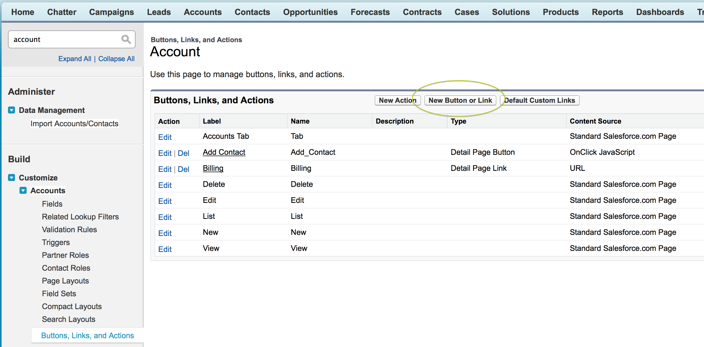

#A Fast Account Rolodex With KnockoutJS

##Step 1: Create a Visualforce Page That Uses the Account Standard Controller

Creating a basic Visualforce page that will be Salesforce1 friendly is very easy, first we need to create a new page and turn off the header, sidebar and standard styling.

1. Launch your browser and go to https://login.salesforce.com.
2. Enter your username (in the form of an email address) and password.
3. Click on your name, and then choose *Developer Console* from the menu.
4. In the Developer Console, choose *File -> New -> Visualforce Page* and then enter a name for the page.
5. Replace the initial code with the following:

```Visualforce
<apex:page standardController="Account" showHeader="false" sidebar="false" standardStylesheets="false">
	<h1><apex:outputText value="{!Account}"/></h1>
</apex:page>
```

6. Make the page easy to access by creating a new custom button on the Account object, via  *Setup -> Customize -> Accounts -> Buttons, Links, and Actions* and cicking *New Button or Link*.


7. Fill in the button details as in the image below, and click *Save*. Your Visualforce page will be available because we used the Account standard controller.


8. Finally, navigate to the Accounts tab, choose an Account and edit the page layout to include the new button.


